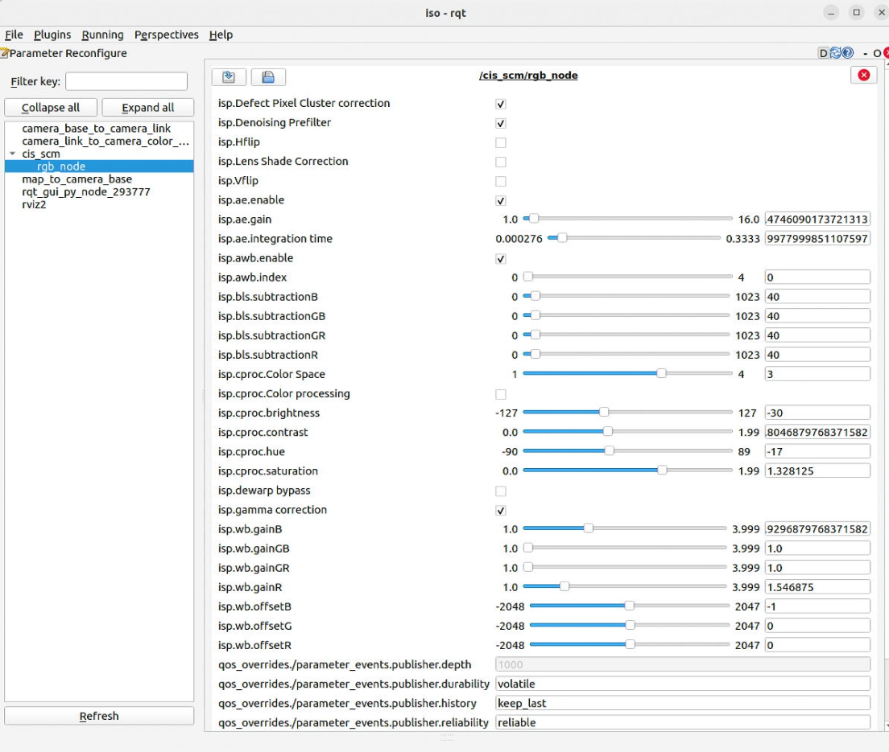

# Camera controls with ROS parameters

SCM nodes can use ROS parameters to tune and get camera controls. 
The controls are:
- ISP controls (`SCM-2M1`, `SCM-8M1` and `SCM-RGBD1`)
- ToF parameters (`SCM-ToF1` and `SCM-RGBD1`)

:info: The camera controls value is based on CIS Procotol. 
Please check the corresponding documentation for more details.

:warning: `SCM-RGBD1` node does not handle parameters tuning yet. (WiP)


## ISP

Available controls:

- Defect pixel cluster correction

- Denoising prefilter

- Lens shade correction

- Flip
    - Horizontal
    - Vertical

- Exposure
    - Auto Exposure enabling
    - Gain
    - Integration time

- Black Level Subtraction
    - Blue
    - Blue-Green
    - Red-Green
    - Red

- Color processing module
    - Enabling
    - Color space
    - Brightness
    - Hue
    - Saturation

- Dewarp bypassing

- Gamma

- Auto white balance
    - Enabling
    - Illumination profile index

- White balance
    - Gain B
    - Gain GB
    - Gain GR
    - Gain R
    - Offset B
    - Offset G
    - Offset R

### White balance mode switching

In order to make the white balance index switching simpler, the `isp.awb.index` ROS parameter behavior is different than the CIS protocol control.

--- 

## ToF parameters

- Min. reflectance
- Min. confidence
- Kill Flying Pixel delta
- Integration time
- History Threshold (deprecated)
- History Length (deprecated)

## Parameter tuning

Parameters are declared and initialized by `ParamHandler` class, use in SCM nodes.
They can be modified with
- CLI args command
- Launch files
- yaml parameter file
- `rqt` application

### RQT

1. Run the SCM node.

1. If `rqt` is not installed, install it with:
    ```bash
    sudo apt update
    sudo apt install ros-<DISTRO>-rqt
    ```
3. In a new terminal source ROS 2 and run `rqt`.
    ```bash
    rqt
    ```
4. Click on SCM's node in the left panel, node name might be located under `cis_scm`
5. Adjust the desired parameter


