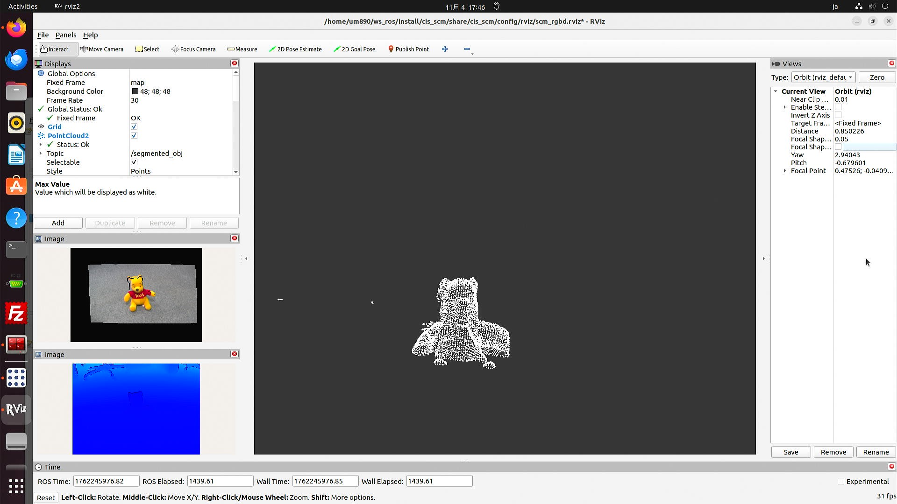

# C++ Sample application with SCM ROS 2 drivers

## Description

This sample code demonstrates how to use SCM ROS 2 drivers by creating a node that performs several processes on an acquired point cloud.
It is mainly based on ROS-industrial's ["Building a Perception Pipeline" tutorial](https://industrial-training-master.readthedocs.io/en/humble/_source/session5/Building-a-Perception-Pipeline.html#building-a-perception-pipeline).

This sample application:
1. Gets a `PointCloud2` message from the `/depth/points` topic published by SCM-ToF1 or SCM-RGBD1
2. Processes the point cloud using functions from [Point Cloud Library](https://pointclouds.org/) (PCL)
3. Publishes the resulting point cloud to a new topic

PCL processes used: 
- `VoxelGrid`: Point cloud downsampling
- `CropBox`: point cloud cropping
- `SACSegmentation`: Plane segmentation with RANSAC algorithm

Application files are located at [pcl_sample.cpp](src/example/pcl_sample.cpp) and [pcl_sample_launch.py](launch/pcl_sample_launch.py)

## Dependencies

`pcl_ros` is required. 
If not already installed, run:
```bash
sudo apt install ros-<ROS_DISTRO>-pcl-ros
```

## Execution

1. In a ROS workspace, compile the SCM ROS 2 drivers and source it:
    ```bash
    cd <ws_path>/
    colcon build
    source install/setup.bash
    ```
2. Launch the camera node + rviz:

    ```bash
    # SCM-ToF1
    ros2 launch cis_scm tof_viz_launch.py

    # SCM-RGBD1
    ros2 launch cis_scm rgbd_viz_launch.py
    ```
3. Launch the sample application: 
    ```bash 
    ros2 launch cis_scm pcl_sample_launch.py
    ```

4. *(Optional)* You can adjust processing parameters by opening another terminal and running:
    ```bash
    rqt
    ```


